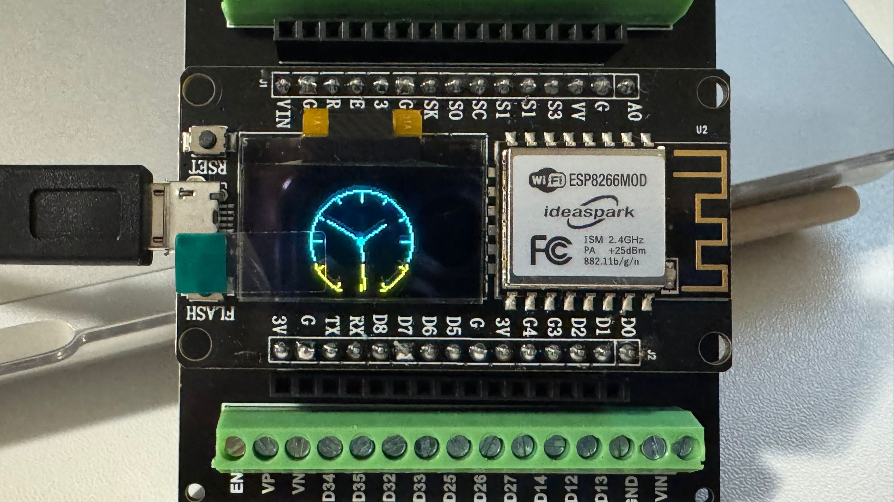
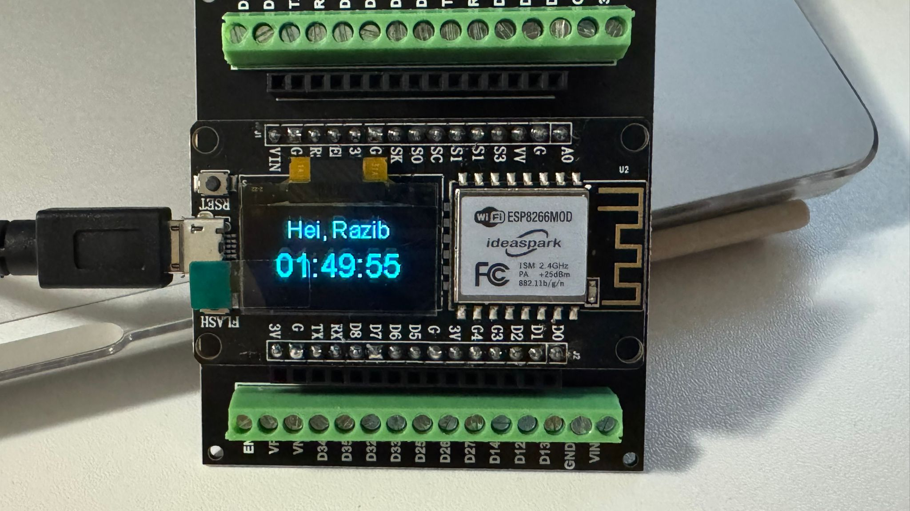

# ESP8266 OLED Clock (Digital + Analog)

A tiny Wi-Fi clock for **ESP8266** with a **0.96" I²C OLED** (SSD1306).
Shows a header line (“Hei, Razib”), a **large digital time** (HH:MM:SS), and a **round analog clock**.
Time is synced from NTP and updated every second.

---
## Setup
setup:
  device: "NodeMCU ESP8266 with 0.96\" OLED Display"

  arduino_ide:
    additional_board_manager_urls:
      - "https://arduino.esp8266.com/stable/package_esp8266com_index.json"
    steps:
      - open: "Arduino IDE → Preferences (Settings)"
      - action: "Paste the URL above into 'Additional Boards Manager URLs'"
      - action: "Click OK"

  boards_manager:
    path: "Tools → Board → Boards Manager…"
    install:
      name: "ESP8266 by ESP8266 Community"
      version: "latest"

  libraries:
    manage_path: "Sketch → Include Library → Manage Libraries…"
    install:
      - name: "ESP8266 and ESP32 OLED driver for SSD1306 displays"
        author: "ThingPulse"
      - name: "U8g2"
        author: "olikraus"
      - name: "Adafruit GFX Library"
        author: "Adafruit"
      - name: "Adafruit SSD1306"
        author: "Adafruit"
      - name: "TimeLib"
        author: "Paul Stoffregen"

first_code:
  description: "Open a ready-made example to verify the OLED and library setup."
  example_path: "File → Examples → ESP8266 and ESP32 OLED driver for SSD1306 displays → SSD1306ClockDemo"

notes:
  - "Use a 2.4 GHz Wi-Fi network; ESP8266 does not support 5 GHz."
  - "If 'Port' is greyed out, install the USB-UART driver (CH340 or CP210x) and use a data-capable USB cable."
  - "Typical I²C wiring: SDA=D2 (GPIO4), SCL=D1 (GPIO5), OLED address 0x3C (change to 0x3D if jumpered)."

## Timezone

By default the example uses **UTC+3** (Finland summer time):

    NTPClient timeClient(ntpUDP, "pool.ntp.org", 3 * 3600, 60000);

See **Auto-DST (recommended)** below to avoid manual changes.

Upload and watch the OLED.

---

## 🧾 How It Works

- Uses `OLEDDisplayUi` to rotate between 2 frames:
  - **Digital frame:** header “Hei, Razib” + big HH:MM:SS
  - **Analog frame:** large round clock with tick marks and hour/min/sec hands
- Syncs NTP time every 60s, renders every second.

---

## 🧩 Customization

**Header text & size**
In `digitalClockFrame`:

    d->setFont(ArialMT_Plain_16);
    d->drawString(64 + x, 0 + y, "Hei, Razib");   // change text here

**Digital time size/position**

    d->setFont(ArialMT_Plain_24);                  // largest built-in
    d->drawString(64 + x, 22 + y, t);              // move up/down by tweaking 22

**Analog clock size**

    const int analogRadius = 30;                   // try 28–31 for SSD1306

**I²C pins and address**

    SSD1306Wire display(0x3c, 12, 14);             // (address, SDA, SCL)
    Wire.begin(12, 14);

Use **0x3D** if your module is solder-jumpered to the alternate I²C address.

**Display type (SH1106 vs SSD1306)**
If your onboard OLED is **SH1106**, switch library include and class:

    #include "SH1106Wire.h"
    SH1106Wire display(0x3c, SDA_PIN, SCL_PIN);

(And remove the SSD1306 include.) Everything else can stay the same.

---

## 🕒 Auto-DST for Europe/Helsinki (Recommended)

Avoid manual UTC+2/UTC+3 edits by using the ESP8266 SNTP with a TZ string:

    #include <time.h>

    void setup() {
      // ... after WiFi is connected:
      configTime(0, 0, "pool.ntp.org", "time.nist.gov");
      setenv("TZ", "EET-2EEST,M3.5.0/3,M10.5.0/4", 1); // Europe/Helsinki
      tzset();
    }

In your frame functions, replace `NTPClient` getters with:

    tm timeinfo;
    if (getLocalTime(&timeinfo)) {
      int h = timeinfo.tm_hour;
      int m = timeinfo.tm_min;
      int s = timeinfo.tm_sec;
      // draw…
    }

With this approach, **remove `NTPClient` and related calls**.

---

## 🚑 Troubleshooting

- **Port is greyed out:** use a proper data USB cable; install **CH340/CP210x** driver; try another USB port/hub.
- **No display output:** run an I²C scanner to confirm **0x3C/0x3D**; check SDA/SCL pins; ensure GND/VDD rails are connected across the breadboard.
- **Nothing on some “WiFi Kit” boards:** many need an OLED **reset pulse on GPIO16 (D0)**. If needed, set that pin to output and toggle LOW→HIGH before `display.init()`.
- **Text upside-down:** toggle `display.flipScreenVertically();`
- **Address conflict:** if you have **two** SSD1306 displays at `0x3C`, change one to `0x3D` (solder jumper on the module), or use a separate I²C bus.

---

## 🗂️ Project Structure (suggested)

project: esp8266-oled-clock
files:
  - name: esp8266_oled_clock.ino
    description: main sketch (digital + analog frames)
  - name: README.md
    description: project readme

---

## 📝 Credits

- OLED driver & UI: **ThingPulse** “ESP8266 and ESP32 OLED driver for SSD1306 displays”
- NTP client: **Fabrice Weinberg** (NTPClient)
- ESP8266 Arduino core: **ESP8266 Community**

---
## 📊 Output

## 🪪 License

This project is provided as-is for personal/educational use.
You may adapt and redistribute; please credit the libraries above.
